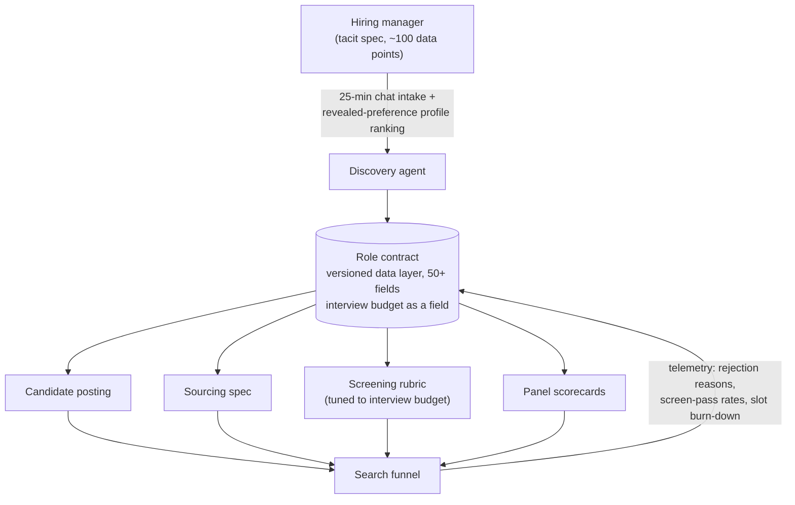

# PRD: Role Contract — Intake Calibration System for SMB Hiring

| | |
|---|---|
| **Version** | 1.1 (scope change: chat-first intake; voice deferred) |
| **Author** | Bhargava Tatavarthi |
| **Status** | Scoped — ready for build |
| **Segment** | India SMB and mid-market (0–200 employees), white-collar lateral hiring |
| **Metrics to chase** | Time to hire, cost to hire |

---

## 1. What problem are we solving

### In the users' words

**Hiring managers** (from customer interviews):
> "We interviewed 15 people to close one position. Most of them, I knew in the first ten minutes it wasn't going to work."
> "The recruiter keeps sending profiles that match the JD. The JD isn't the problem — the JD was never the role."

**Recruiters / HR generalists:**
> "Three weeks into sourcing, the manager tells me he actually needs someone with X. My whole pipeline is dead." (pattern reported across interviews; documented industry-wide — recruiters push candidates who check every JD box but miss the manager's "unwritten expectations", and with vague feedback are "left to guess what's working and what's not")
> "Every rejection is just 'not a fit.' Not a fit against what? Nobody wrote it down."

**New hires** (the downstream victim):
> Six months in, "the vague role shifts under their feet" — both sides feel misled, and the recruiting cycle restarts.

### The problem, synthesized

**When an SMB opens a role, the definition of "good" is never written down.** The system of record captures ~10 shallow fields; the hiring manager's actual spec has ~100 data points (why the role exists, what success at 90 days looks like, real deal-breakers, acceptable trade-offs). Because it is never captured, it cannot be shared with the recruiter, shown to the candidate, or enforced in the interview loop — so every party works from a different imagined role, and the truth emerges one expensive rejection at a time.

**Root cause: not a communication failure between HM and recruiter — a data-loss failure at the point of capture.** Churned pipelines, wasted interviews, and "not a fit" dead ends are the same lost data resurfacing as cost.

### Who has this problem

- **Hiring manager (primary):** owns the outcome and the vacant-seat cost; ~10 interview slots of senior time per role; no tool that captures what they actually know.
- **Recruiter / HR generalist (secondary):** accountable for speed, briefed in two lines, blamed when the pipeline is "wrong."
- **Candidate (tertiary):** applies to a vague posting, builds the wrong mental model, discovers the truth at the worst time.

---

## 2. Why are we solving it

Two first-order reasons. Everything else is derivative.

**1. Time: the uncaptured spec restarts the clock.** The role definition gets "clarified" mid-search, and every clarification resets the pipeline. Misaligned teams are 41% more likely to change the requisition mid-search, adding 38% to time-to-fill (Gartner). For an SMB whose entire time-to-hire budget is 15–30 days, one churn event doubles it. Largest controllable driver of time to hire.

**2. Cost: the interview budget is spent manufacturing rejections.** 10–15 candidates interviewed to select 1–2 means most of 40–60 senior-team hours per hire go to candidates who were never going to pass criteria that were never written down. Largest controllable driver of cost to hire.

---

## 3. Why now

**1. The cost of a vague spec has exploded at the top of the funnel.** Applications per hire have tripled since 2021, inflated by AI spray-and-pray applications; 97% of applicants are eliminated before speaking to a human. A vague JD used to produce a mediocre pipeline; it now produces a flooded one that a two-person HR team must triage by hand.

**2. The candidates worth hiring now filter on specificity before applying.** 60% skip postings without a salary range; half avoid unclear JDs and unrealistic requirement lists. A vague posting silently loses exactly the candidates the HM wants while retaining the noise.

*Enabler (why newly solvable, not why it matters):* conversational AI has collapsed the cost of a senior-recruiter-quality intake to near zero.

---

## 4. High-level solution

**One sentence:** capture the hiring manager's full definition of the role into a versioned Role Contract, generate every downstream artifact from it, and enforce it as the referee for every decision in the search.

---

## 5. User flow (primary journey)

1. **Open role.** Recruiter creates a req; the system schedules/launches the intake with the HM.
2. **Intake.** Discovery agent runs a ~25-minute structured conversation with the HM (conversational chat; voice is a later interface layer), covering six layers: business rationale → success definition → candidate profile → market reality → process contract → drift rules. Includes force-ranking 5–8 sample profiles to capture revealed preferences. Question set: see the Intake Instrument spec (companion doc).
3. **Contract review.** System generates Role Contract v1 (one-pager). HM and recruiter approve — this is the sign-off gate before any sourcing.
4. **Render.** System generates the four views: candidate posting, sourcing spec, screening rubric, panel scorecards. Recruiter publishes/distributes.
5. **Run the search.** Every candidate decision (screen pass, HM review, interview feedback) is logged against contract criteria. Rejections must cite a criterion.
6. **Enforce.** Repeated rejections on an uncontracted reason trigger an amendment prompt → contract v2 → all views regenerate. Slot burn-down warns before the interview budget exhausts without an offer.
7. **Close.** Offer made; contract archived with full decision history for the eventual outcome loop.

---

## 6. Functional requirements (v1)

| ID | Requirement | Priority |
|---|---|---|
| F1 | Conversational intake covering the 6-layer schema (~50–60 fields), with follow-up questioning and inconsistency challenges | P0 |
| F2 | Revealed-preference exercise: present 5–8 profiles, capture force-ranking + reasons | P0 |
| F3 | Role Contract generation: structured record + human-readable one-pager; HM/recruiter approval gate | P0 |
| F4 | Contract versioning: amendments create versions; full diff history | P0 |
| F5 | Rendering: candidate posting, sourcing spec, screening rubric, panel scorecards — regenerated on every version | P0 |
| F6 | Rejection logging: every rejection cites a contract criterion or triggers "uncontracted reason" flow | P0 |
| F7 | Drift alerts: N rejections on the same uncontracted reason → amendment prompt | P1 |
| F8 | Interview-budget burn-down with exhaustion projection | P1 |
| F9 | Market-reality check at intake: flag unrealistic requirement/comp combinations | P1 |
| F10 | Voice-led intake (speech in/out) | P2 — deferred; chat is the primary medium |
| F11 | Candidate-facing Q&A over the contract | P2 |
| F12 | ATS export/integration | P2 |

**MVP boundary (0→1 concierge):** F1–F6, conversational chat intake, 3–5 design partners, founder-in-the-loop as the enforcement layer. Enforcement automation (F7–F9) follows once the contract loop is proven to move first-shortlist acceptance; voice (F10) is an interface upgrade layered on last.

---

## 7. Metrics

| Level | Metric | Baseline | Target |
|---|---|---|---|
| North star | Interviews per hire, within budget | 10–15 | ≤8 |
| North star (lagging) | Time to hire (req open → offer accepted) | 15–30 days | −30% |
| Driver | First-shortlist acceptance (of first 5 submitted, HM agrees to interview) | baselined in pilot | ≥70% |
| Driver | Mid-search requisition change rate | baselined in pilot | halved |
| Guardrail | HM quality rating of hire at 90 days | — | no regression |

Offer-to-join and long-run quality-of-hire are deliberately excluded: real, but this product's claim on them is indirect.

---

## 8. Milestones and release criteria

| Phase | Scope | Exit criteria |
|---|---|---|
| M0 (weeks 1–2) | Intake instrument + contract template; run manually on 3 live reqs | HM completes intake ≥80% of attempts; contract approved without major rework |
| M1 (weeks 3–8) | MVP (F1–F6) with 3–5 design partners, 10+ reqs | First-shortlist acceptance ≥60% on contracted reqs; req-change rate measured |
| M2 (weeks 9–16) | Enforcement automation (F7–F9) | ≥70% first-shortlist acceptance; ≥1 paying customer at per-req pricing |
| M3 | Voice intake, candidate Q&A, ATS integration, scale | Retention: contracts still referenced at week 4 of search on ≥80% of reqs |

---

## 9. Non-goals (v1)

Not an ATS; not sourcing; not notice-period engagement; not OKR/headcount-planning integration (10→100 expansion, earned after the contract loop is proven).

---

## 10. Key risks

1. **Behavior-change tax:** will an SMB founder/HM give 25 minutes per req? M0 exit criterion tests this before anything is built.
2. **Comp transparency resistance (India SMB):** fallback — committed band at first screen; measure the funnel cost of opacity per customer.
3. **Over-filtering:** maximal specificity can shrink the pool below viability; renderer needs a predicted-pool-size check (F9).
4. **Incumbent velocity:** meeting-capture intake AI is commoditizing. Defensibility order: enforcement loop → upstream business link → outcome-labeled dataset.
